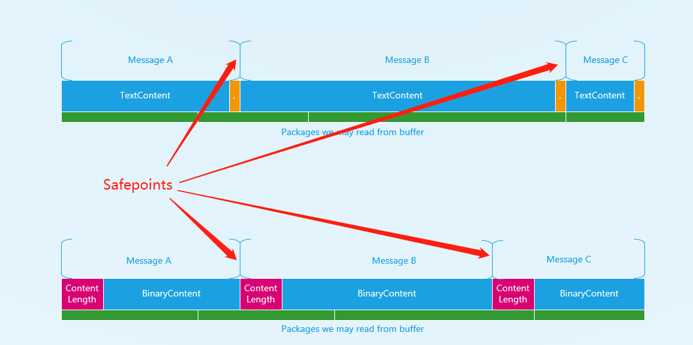

# Client Connection migration when ingress reload

## Background

SignalR client connections and server connections connect to ASRS via ingress.

The ingress reload will cause both client and server connections to drop.

Client connections will be dropped during ingress instance reloads if:

### Scenario A

Client connections are connected to the ingress instance being reloaded.

Client connections in this scenario will be dropped inevitably. However, customers could leverage from [Stateful Reconnect]() feature to reconnect the client connection using the same connectionId.

### Scenario B

Client connections have a logical link to a server connection, which is connected to the ingress instance being reloaded.

**The ASRS instance maintains another server connection to the same server**

In this scenario, server connection B is going to be dropped.

The client connection can be rerouted to the server connection A from B on the same server.

## Goal

**Achieve a logical migration mechanism**

Client connections that links to the server connection, which is connected to a ingress instance that is being reloaded, should be migrated to another server connection that is not affected instead of being dropped.

## Status quo

### Safe point

A point within buffered messages, positioned between intact messages.

### Incoming messages

Messages send from client to server

### Outgoing messages

Messages send from server to client

### Application Task

This task handles incoming messages from ASRS and builds outgoing messages then sends them to the pipe[1].

### Transportation Task (outgoing task)

This task reads messages from the pipe[1] and dispatch them to the linked server connection.

[1] pipe: the `ServiceConnection`, a class in the server SDK, represents a physical server connection to ASRS.

## Basic flow

### Scenario B

**Incoming messages** will be blocked until the reroute process success.

**Outgoing messages** will be blocked until the reroute has been acked by the reloaded server connection.

| Step | Instance   | Description                                                                  |
| ---- | ---------- | ---------------------------------------------------------------------------- |
| 1    | Ingress    | Call ASRS Rest API for ingress reload.                                       |
| 2    | ASRS       | Block client connection incoming messages. |
| 3    | ASRS       | Send `MigrateConnectionRequestMessage` to server.                            |
| 4    | App server | Dispatch the message in 3 to client connection.                              |
| 5    | App server | Pause `Transportation Task` to block outgoing messages.                      |
| 6    | App server | Reply `MigrateConnectionResponseMessage` to ASRS                             |
| 7    | ASRS       | Unblock client connection incoming messages.       |
|      |            | Reply `MigrateConnectionAckMessage` to the target server connection.                                                   |
| 8    | App server | Resume `Transportation Task` to unblock outgoing messages.                  |

### ServiceProtocol

[Add Connection Migrate messages #1964](https://github.com/Azure/azure-signalr/pull/1964)