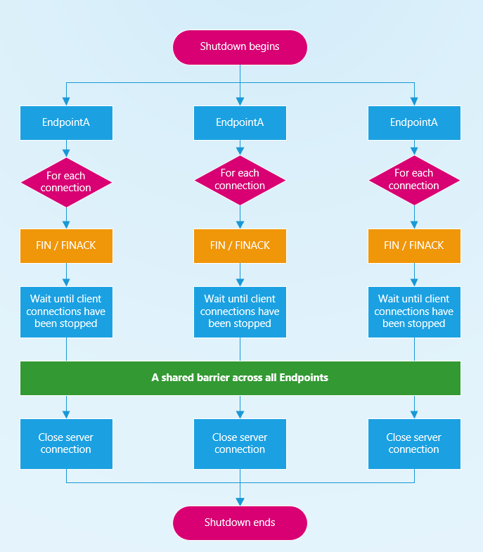
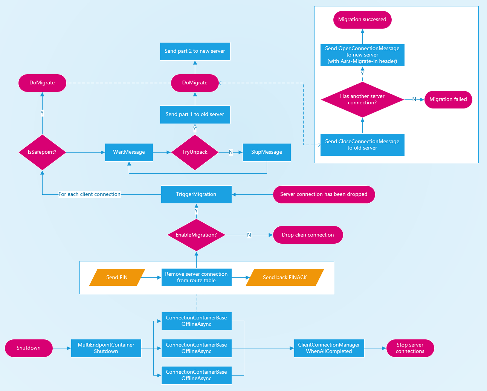

# Server connection migration

## Goals

Our goal is to prevent our customers from experiencing the connection drops while doing their server's rolling-update.

```
Client <--- client connection ---> Azure SignalR Service <--- server connection ---> App server
```

Since our `Service` held server connections from more than 1 server in most time, once a server is going to be shutdown, we could simply **migrate** the client connection by rerouting it to another available server to avoid dropping the client connections on it.

## Definitions

### ASRS

Azure SignalR Service.

### Safepoint

```
                    Safepoint               Safepoint   Safepoint
                        |                       |           |
| Message 1 | Message 2 | Message 3 | Message 4 | Message 5 |
| previous data ...     |        Package 1      | package 2 | 
```

A package could be split into multiple messages during the transmission.

Since we have to make sure all messages belong to 1 specific package have been sent to the same server.

Our migration could only happen on the boundary of the package, which we called "safepoint".


## Proposal

### Graceful shutdown server

[#689 Graceful Shutdown](https://github.com/Azure/azure-signalr/pull/689)

It will allow our server SDK to inform our `ASRS` to remove the server from its routing table.
New client connections will not be assigned to the removed server after doing this.

And it will wait at most 30s (can be overwritten through ServiceOptions) for our customers to perform the disconnection for the established client connections.

Once all client connections have been closed (or reached timeout), the server will be shutdown.



### Server connection migration

[#739 Server Connection Migration](https://github.com/Azure/azure-signalr/pull/739).

Instead of letting our customers handle client disconnections, we introduced a mechanism to prevent client connections to be dropped.

#### Workflow

1. Service received a `FIN` from a server connection.

   Instead of waiting `client connection` to close on their own.
   We marked every `client connection` (assigned to this server) into `InMigration` status.

2. Once an `InMigration` connection received a message from the client.

   We will test if we were already at a `safepoint` (see previous).

   If so, we would start the migration process immediately.

   If not, we will still send the message to the current server and try again.

3. Do migration.

   We will randomly choose a server connection from local server connections and reroute the client connection to it.

   - If we can't find a server connection locally, the client connection will still be dropped.

   After a new server connection has been chosen.

   We will send a `CloseConnectionMessage` to the old server, and send an `OpenConnectionMessage` to the new server, with a `handshake request` that we stored in the **ConnectionContext` previously.

   Both `CloseConnectionMessage` and `OpenConnectionMessage` will contain the new server id, which to help our customer to distinguish between normally closed/opened connections with migrated connections.

> Note that a client connection can be migrated multiple times.



## Usage

First of all, our customer could only benefit from this feature if his server ran in **stateless mode**, or handled their connection context regardless of which server the client connected to (like using Redis/MySQL).

We introduced 3 new options to our `ServiceOptions`

- EnableGracefulShutdown (false)

- ServerShutdownTimeout (30 seconds)

- MigrationLevel (0, Off)

They can be simply overwritten through the following codes:

```C#
services.AddSignalR()
    .AddAzureSignalR(option =>
    {
        option.EnableGracefulShutdown = true;
        option.ServerShutdownTimeout = TimeSpan.FromSeconds(60);
        option.MigrationLevel = ServiceConnectionMigrationLevel.ShutdownOnly;
    });
```

#### Migration levels

Server connection migration should always work with **Graceful shutdown** to maximize its ability, though it can work alone (with potential data losses).

> - 0, Off, a client connection can not be migrated to another server.
> - 1, ShutdownOnly, a client connection can be migrated only if the matched server was shut down gracefully.
> - 2, Any, a client connection can be migrated even if the matched server connection was dropped accidentally. (may cause data loss)

#### How to distinguish normal connections and **migrated** connections.

Though there isn't much to worry about if our customer's server ran in stateless mode,
we provided an interface (as ConnectionFeature) to help our user distinguish if a connection was migrated-in or migrated-out.

```C#
public override async Task OnConnectedAsync()
{
    var feature = Context.Features.Get<IConnectionMigrationFeature>();
    if (feature != null)
    {
        Console.WriteLine($"connection was migrated from {feature.MigrateFrom}");
    }
    Console.WriteLine($"{Context.ConnectionId} connected.");
    await base.OnConnectedAsync();
}
public override async Task OnDisconnectedAsync(Exception e)
{
    var feature = Context.Features.Get<IConnectionMigrationFeature>();
    if (feature != null)
    {
        Console.WriteLine($"connection has been migrated to {feature.MigrateTo}");
    }
    Console.WriteLine($"{Context.ConnectionId} disconnected.");
    await base.OnDisconnectedAsync(e);
}
```

## Challenges/Open Questions

### What would happen if a client connection had been migrated to a ready-to-restart server?

This occurs while doing migrations. Though it won't cause big problems since our connections will be "randomly" migrated to different servers, and they can be migrated multiple times.

Considering if we restarted servers in A -> B -> C order and migration has been enabled.

In the worst case, a connection on server A will be migrated to B, and then migrated to C, then migrated to either A or B. Though only 25% of clients will experience this.

### How we find a "safepoint" in a stream?

We introduced an `unpacker` to do this.

For `DelimeterBasedProtocol`, we simply find the designated `delimiter` every time we received a message.

For `LengthBasedProtocol`, we will parse the header part (the part described content-length), then stored the remained-length (since a big package can be decoupled into multiple messages), so we can know where did a package end and did migrate for it.

Note none of them depending on buffering the messages, we did it on-fly.
